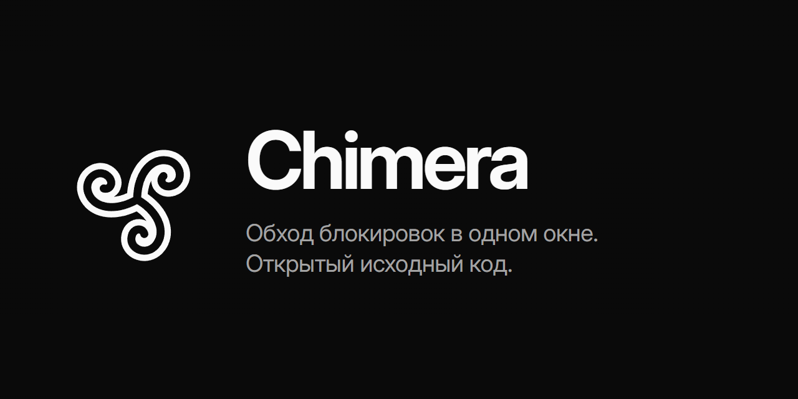

<p align="center">
  
</p>

<p align="center">
  <a href="https://github.com/emptyenemy/chimera/releases/latest"></a>
  <a href="LICENSE"></a>
  
  <a href="https://github.com/emptyenemy/chimera/actions/workflows/ci.yml"></a>
</p>

<p align="center">
  <a href="https://github.com/emptyenemy/chimera/releases/latest"><b>Скачать</b></a>
  &nbsp;·&nbsp;
  <a href="https://emptyenemy.github.io/chimera/">Сайт</a>
  &nbsp;·&nbsp;
  <a href="docs/ROADMAP.md">Планы</a>
  &nbsp;·&nbsp;
  <a href="https://github.com/emptyenemy/chimera/issues/new">Сообщить о проблеме</a>
</p>

---

**Chimera** — одно окно вместо набора скриптов для обхода блокировок в России (ТСПУ Роскомнадзора). Стратегии, прокси, Telegram, hosts и DNS собраны в одном приложении для Windows, а общий список сайтов работает сразу во всех способах. Исходный код открыт, лицензия MIT.

## Быстрый старт

1. Скачайте `Chimera-<версия>-win64.zip` со страницы [Releases](https://github.com/emptyenemy/chimera/releases/latest).
2. Распакуйте архив и запустите `Chimera.exe`.
3. Включите нужный способ обхода. Python и git не нужны, обновляется программа сама, по кнопке.

## Возможности

Способы независимы друг от друга и работают поверх общего слоя списков доменов:

- **Стратегии (zapret2 / winws2)** — обход DPI через [bol-van/zapret2](https://github.com/bol-van/zapret2), стратегии портированы из [Flowseal/zapret-discord-youtube](https://github.com/Flowseal/zapret-discord-youtube);
- **Прокси (sing-box)** — выборочный VLESS/Trojan/SS/VMess только для доменов из списков (режим PAC без админа или TUN);
- **Telegram-прокси** — MTProto-прокси на базе [Flowseal/tg-ws-proxy](https://github.com/Flowseal/tg-ws-proxy);
- **Hosts** — подмена IP в системном hosts через «разблокирующие» DNS (xbox / comss / malw);
- **DNS** — переключение системного DNS (DNS Jumper внутри программы);
- **Проверки** — блокировка по реестру РКН ([cheburcheck](https://github.com/LowderPlay/cheburcheck)) и локальная достижимость доменов.

## Стек

- **Python 3** + фронт на HTML/CSS/JS в `ui/web/`, бэкенд в `modules/`. Движок интерфейса выбирается в `config.json` (`ui_backend`): [PySide6](https://doc.qt.io/qtforpython/) (окно с `QWebEngineView`, свой Chromium, мост `QWebChannel`), [pywebview](https://pywebview.flowrl.com/) (окно на системном WebView2, мост `js_api`) или `browser` — своего окна нет вообще, интерфейс открывается вкладкой в браузере по умолчанию (локальный HTTP-сервер на стандартной библиотеке, мост — JSON-RPC + long-poll, доступ по одноразовому токену). Фронтенд один и тот же, мост определяет сам.
- Логика — в `modules/`, интерфейс (`ui/api.py`) — тонкий JS-мост. Внешние проекты подключены git-сабмодулями в `upstream/` и используются как есть.

```
.
├── main.py            # вход: UAC-элевация, выбор режима из config.json
├── config.json        # interface (ui|tui|service), ui_backend (pyside6|pywebview|browser) + общие настройки
├── data/              # рантайм-данные модулей (state/логи/сгенерированные конфиги, не в git) — modules/paths.py
├── modules/           # вся логика: winws, proxy, tgproxy, hosts, dns_jumper, domains, ...
├── ui/                # api.py (методы для фронта) + hub.py (пуш состояния) + backend_* + web/ (фронт: js/core.js, js/pages/, css/)
├── lists/             # списки доменов по сервисам (общий слой для всех модулей)
├── strategies/        # стратегии winws2 (*.txt) + assets/ (fake-блобы) + hostlists/
├── assets/logo/       # логотип: chimera.svg (основной), chimera-simple.svg (запасной), chimera.ico
├── tools/             # port_flowseal.py — генератор стратегий из .bat Flowseal; make_logo.py — логотип и иконка
├── upstream/          # сабмодули: zapret2, tg-ws-proxy, zapret-discord-youtube
└── docs/ROADMAP.md    # актуальный статус готового/планируемого
```

## Установка и запуск

Готовая сборка — со страницы [Releases](https://github.com/emptyenemy/chimera/releases): скачать
`Chimera-<версия>-win64.zip`, распаковать, запустить `Chimera.exe`. Python и git не нужны, дальше
программа обновляется сама — по кнопке в «Настройки → Обновление Chimera». Как выпускаются
релизы — [docs/RELEASES.md](docs/RELEASES.md).

Из исходников:

```powershell
git clone --recurse-submodules <repo-url>
# если клонировали без сабмодулей:
git submodule update --init

pip install -r requirements.txt
python main.py
```

Приложение само запросит права администратора (UAC) — они нужны для записи в hosts, смены DNS, запуска winws2 и режима TUN у прокси. Режим PAC у прокси и Telegram-прокси работают и без админа.

### Бинарные зависимости (не в репозитории)

Оба ставятся одной командой `python tools/fetch_bins.py` (пиннутые версии, sing-box — со сверкой SHA256).

- `bin/zapret-win-bundle/zapret-winws/` — `winws2.exe` + lua + WinDivert ([bol-van/zapret-win-bundle](https://github.com/bol-van/zapret-win-bundle)); коммит бандла пиннут в `tools/fetch_bins.py`, держать в соответствии с сабмодулем `upstream/zapret2`.
- `bin/sing-box/sing-box.exe` — ещё качается кнопкой из UI (вкладка «Прокси»); версия пиннута в `modules/proxy/manager.py`.

## Обновление внешних источников

Проще всего — из программы: **Настройки → Источники и обновления**. «Проверить» в строке
сверяет один источник (результаты общей проверки приезжают по мере готовности, а не все разом),
«Обновить» — подтягивает свежую версию (для стратегий Flowseal сразу перепортирует
`strategies/*.txt`), «Обновить всё» — проходит по всем, где есть обновление. Пиннутые в коде
версии (sing-box, шрифты) и Python кнопкой не обновляются — только правкой исходников,
потому что вместе с версией меняется схема конфига.

Руками то же самое — сабмодули не форкаются и не правятся, обновление только через git:

```powershell
git submodule update --remote upstream/zapret2
git add upstream/zapret2
git commit -m "bump zapret2"
```

После обновления `upstream/zapret-discord-youtube` стратегии перегенерируются:

```powershell
python tools/port_flowseal.py
```

## Разработка

```powershell
pip install -r requirements-dev.txt
python -m pytest -q      # тесты — только чистая логика, без сети и без GUI
ruff check .              # линт (правила и исключения — в pyproject.toml)
```

## Режимы запуска (`config.json` → `interface`)

- **`ui`** (по умолчанию) — окно, как описано выше.
- **`tui`** — терминальное меню без окна: статус модулей, старт/стоп winws/прокси/TG, hosts, DNS, хвост логов. Работает через тот же класс `Api`, что и фронт. Запуск — `python main.py` с `"interface": "tui"` в конфиге.
- **`service`** — фоновый процесс без окна и без трея, поднимает то, что помечено автозапуском (tg/winws/proxy), и держит это между перезагрузками. Управление — отдельной командой, независимо от `interface` в конфиге:

  ```powershell
  python main.py service install [--dry-run]    # задача в Планировщике на старт системы (SYSTEM, наивысшие права)
  python main.py service uninstall [--dry-run]
  python main.py service start                   # поднять фон немедленно, не дожидаясь перезагрузки
  python main.py service stop                     # сигнал остановиться (именованное событие Windows)
  python main.py service status                   # установлена ли задача / запущен ли фон
  python main.py service run                       # сам фоновый процесс — это и зовёт задача планировщика
  ```

  Нюансы:
  - Отдельной службы Windows (SCM) нет — «служба» это задача Планировщика заданий с триггером на старт системы и принципалом SYSTEM, по той же схеме, что и автозапуск GUI (`modules/autostart.py`), но без интерактивного логона и без pywin32.
  - Прокси в режиме **PAC** пишет системный прокси в `HKCU` текущего пользователя — под SYSTEM это чужой (и по сути ничей) куст, поэтому под сервисом автозапуск прокси в PAC пропускается (с записью в `data/logs/service.log`) — работает только режим **TUN**.
  - Служба и UI не поднимают процессы дважды: если служба уже запущена, UI-режим не стартует свои автозапуски и не гасит процессы при закрытии окна — единственный владелец в этом случае служба (`app_info().service_running`).
  - Лог — `data/logs/service.log`, pid — `data/service.pid` (только для отображения в `status`; источник истины о том, жив ли процесс, — именованный мьютекс `Global\CHIMERA_Service_Running`).

## Статус

Ранняя стадия, активная разработка. Подробности — в [`docs/ROADMAP.md`](docs/ROADMAP.md).

## Лицензия

[MIT](LICENSE). Все используемые внешние источники (`upstream/zapret2`, `upstream/tg-ws-proxy`, `upstream/zapret-discord-youtube`) — тоже MIT.
